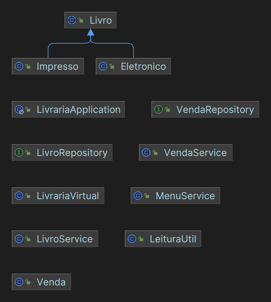

# Livraria Virtual - Sistema de Gerenciamento

Este repositório contém o código fonte do projeto de uma Livraria Virtual, desenvolvido utilizando as tecnologias Spring Boot, JPA e MySQL. O objetivo principal desse projeto é implementar um sistema de gerenciamento de uma livraria, explorando os conceitos de composição, herança e polimorfismo.

## Diagrama de Classes UML




## Colaboradores

- [@p-oliveira7](https://github.com/p-oliveira7)
- [@vinicchaves](https://github.com/vinicchaves)
- [@jcfbernardo](https://github.com/jcfbernardo)

## Tecnologias Utilizadas

- Spring Boot
- Spring Data JPA
- MySQL

## Visão Geral do Projeto

O projeto tem como objetivo criar uma plataforma de gerenciamento para uma livraria virtual. Através desta plataforma, os usuários poderão navegar pelo catálogo de livros, fazer pedidos, gerenciar suas compras e acessar informações detalhadas sobre os livros disponíveis.

## Configuração do Ambiente

### Pré-requisitos

- Java Development Kit (JDK) versão 20 ou superior
- Maven
- MySQL Server

### Passos para Execução

1. Clone o repositório:

```
git clone https://github.com/vinicchaves/desafio-livraria-solutis.git
```

2. Acesse o diretório do projeto:

```
cd desafio-livraria-solutis
```

3. Crie um banco de dados MySQL chamado `livraria`:

```sql
CREATE DATABASE livraria;
```

4. Configure as informações de conexão com o banco de dados no arquivo `src/main/resources/application.properties`:

```properties
spring.datasource.url=jdbc:mysql://localhost:3306/livraria
spring.datasource.username=SEU_USUARIO
spring.datasource.password=SUA_SENHA
```

5. Execute o aplicativo Spring Boot:

```bash
mvn spring-boot:run
```

6. O aplicativo estará disponível em `http://localhost:8080`. Acesse este URL no navegador para interagir com a Livraria Virtual.

## Estrutura do Projeto

O projeto está estruturado da seguinte forma:

- `src/main/java/br/solutis/squad7/livraria`: Contém as classes Java do projeto, incluindo controladores, serviços e modelos.
- `src/main/resources`: Contém os recursos, como arquivos de configuração e templates.

## Dependências

O arquivo `pom.xml` especifica as dependências do projeto. As principais dependências utilizadas são:

- `spring-boot-starter-data-jpa`: Para integração do Spring Data JPA.
- `spring-boot-starter-web`: Para desenvolvimento de aplicações web com Spring Boot.
- `mysql-connector-j`: Driver de conexão MySQL.
- `spring-boot-starter-test`: Dependências para testes automatizados.

## Conclusão

Este projeto demonstra a implementação de um sistema de gerenciamento de uma livraria virtual, utilizando as tecnologias Spring Boot, JPA e MySQL. Ao explorar os conceitos de composição, herança e polimorfismo, ele oferece uma base sólida para o desenvolvimento de plataformas semelhantes.
